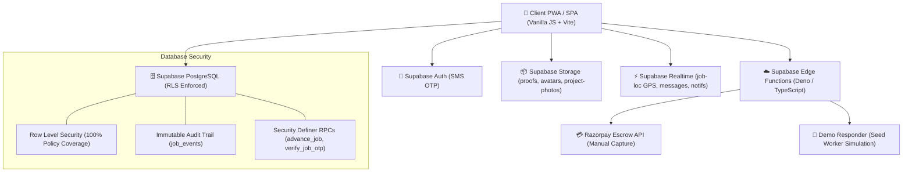

<div align="center">

# 🏗️ NIRMAAN (निर्माण)
### *Kaam Milega. Samman Milega.*
**Bharat ka Nirmaan, Nahi Rukega.**

A direct, fair marketplace connecting India's construction workers (*Kaarigars*) directly with households and builders — zero thekedar commission, verified trust scores, live GPS dispatch, digital escrow, photo proofs, and offline-first project management.

<br />

[](https://github.com/ayushjha/nirmaan1/actions/workflows/ci.yml)
[](https://nirmaan-m.vercel.app/)

</div>

---

## 🏛️ System Architecture



---

## ⚡ 5-Minute Supabase Setup

Nirmaan runs on a standard Supabase project. You can plug in your own Supabase instance in under 5 minutes:

### 1. Create a Supabase Project
1. Go to [database.new](https://database.new) and create a new project.
2. In **Authentication → Providers → Phone**, enable Phone authentication.
   - For production: Configure Twilio or MessageBird SMS provider.
   - For testing/evaluation: Add a Test Phone Number (e.g. `+919876543210` with OTP `123456`) under **Authentication → Providers → Phone → Test Phone Numbers**.

### 2. Run Database Migrations in SQL Editor
Open your Supabase **SQL Editor** and run the migration files in strict sequential order:

| Step | Migration File | Purpose |
|---|---|---|
| 1️⃣ | `supabase/migrations/001_schema.sql` | Core schema (`profiles`, `worker_profiles`, `jobs`, `job_events`, `job_proofs`, `payments`, `reviews`, `messages`, `notifications`, `materials`, `projects`) |
| 2️⃣ | `supabase/migrations/002_rls.sql` | Row Level Security (RLS) policies on every table with `is_admin()` helper |
| 3️⃣ | `supabase/migrations/003_functions.sql` | Security definer RPCs (`nearby_workers`, `create_job`, `advance_job`, `verify_job_otp`, `submit_review`, triggers) |
| 4️⃣ | `supabase/migrations/004_storage.sql` | Storage buckets (`proofs`, `avatars`, `project-photos`) and storage RLS |
| 5️⃣ | `supabase/migrations/005_seed.sql` | 300 realistic NCR verified worker profiles with `is_seed = true` |
| 6️⃣ | `supabase/migrations/006_demo_responder.sql` | Automated seed worker advancement RPC (`demo_advance_job`) and settings |

### 3. Deploy Edge Functions (Optional for Razorpay / Automated Responder)
Install the Supabase CLI and link your project:
```bash
npx supabase login
npx supabase link --project-ref <your-project-ref>

# Set Edge Function secrets
npx supabase secrets set RAZORPAY_KEY_ID=rzp_test_... RAZORPAY_KEY_SECRET=...

# Deploy all Edge Functions
npx supabase functions deploy create-order
npx supabase functions deploy capture-payment
npx supabase functions deploy refund-payment
npx supabase functions deploy razorpay-webhook
npx supabase functions deploy demo-responder
```

*(Note: If Razorpay keys are not configured, Nirmaan automatically falls back to an authenticated database test ledger, preserving 100% of the UI flow seamlessly!)*

### 4. Configure Client Environment
Create a `.env` file in the project root:
```env
VITE_SUPABASE_URL=https://<your-project-ref>.supabase.co
VITE_SUPABASE_ANON_KEY=eyJhbGciOiJIUzI1NiIsInR5cCI6IkpXVCJ9...
VITE_RAZORPAY_KEY_ID=rzp_test_optional
VITE_DEMO_HELP=true
```

---

## 🧪 Test Phone Numbers & Evaluator Guide

For testing without incurring SMS charges, configure Supabase Test Phone Numbers:

| Role | Test Phone Number | Default OTP | Notes |
|---|---|---|---|
| **Customer / Builder** | `+91 98765 43210` | `123456` | Logs directly into Customer view |
| **Kaarigar / Worker** | `+91 98111 22233` | `123456` | Logs directly into Kaarigar partner view |
| **Platform Admin** | Any verified user with `is_admin = true` | `123456` | Accesses `#/admin` verification queue |

To grant Admin access to an account, run in Supabase SQL Editor:
```sql
update public.profiles set is_admin = true where phone = '+919876543210';
```

---

## 🤖 Demo Responder (Seed Worker Simulation)

When hiring any of the 300 seed workers (`is_seed = true`), the **Demo Responder** automatically drives the job forward on a realistic timeline so evaluators never hit a dead end:
- **4 seconds**: Kaarigar accepts booking (`requested` → `accepted`).
- **12 seconds**: Kaarigar departs (`accepted` → `on_the_way`), live GPS movements broadcast every 3s over Realtime with dynamic ETA.
- **30 seconds**: Kaarigar arrives on site (`on_the_way` → `arrived`).
- **On-Spot Handshake**: Customer shares 4-digit PIN (or clicks *⚡ Simulate Kaarigar Entering PIN*) → `in_progress`.
- **45 seconds**: Sample completion photo uploaded with SHA-256 hash → `work_submitted`.
- **Settlement**: Customer inspects photo and clicks *Approve Work & Release Payment* → `settled` + printable receipt.

### Where to Toggle `demo_responder`:
- **In Supabase SQL**:
  ```sql
  update public.app_settings set value = 'false' where key = 'demo_responder';
  ```
- **In Browser Console**:
  ```javascript
  localStorage.setItem('nirmaan_demo_responder', 'false');
  ```
- For full details, see [docs/DEMO.md](docs/DEMO.md).

---

## 📜 Available Scripts

| Command | Description |
|---|---|
| `npm run dev` | Start Vite development server (`http://localhost:5173`) |
| `npm test` | Run all 18 unit tests and the 17-step end-to-end smoke test runner |
| `npm run build` | Build production bundle in `dist/` |
| `npm run preview` | Preview production build locally |
| `node scripts/smoke.mjs` | Run standalone end-to-end smoke test script |

---

## 📁 Repository Structure

```
nirmaan1/
├── index.html                   # Master HTML entry point
├── js/app.js                    # Application bootstrapper
├── core/
│   ├── router.js                # Hash router with route guards (auth, onboarding, admin, 404)
│   ├── store.js                 # Reactive state store with Supabase auth sync
│   ├── ui.js                    # UI utilities (toast, escape, currency, date, skeletons, error banner)
│   ├── i18n.js                  # English & Hindi translation engine
│   └── theme.js                 # Light & dark theme manager
├── components/
│   ├── header.js                # Dual-role switcher, notification bell & modal
│   ├── bottom-nav.js            # Mobile bottom navigation bar
│   ├── map.js                   # Leaflet map wrapper with routing & worker pins
│   ├── kaarigar-card.js         # Kaarigar profile card component
│   ├── proof-capture.js         # Camera capture, client downscale, SHA-256 hash & signed URLs
│   └── chat-modal.js            # Realtime in-app customer-worker chat
├── pages/
│   ├── splash.js                # Role selector & entry splash
│   ├── auth.js                  # Real 6-digit SMS OTP authentication
│   ├── onboarding.js            # KYC profile setup (Aadhaar number excluded, selfie camera)
│   ├── user-home.js             # Map-first discovery with trade & radius filters
│   ├── kaarigar-detail.js       # Worker profile, verified badges, reviews, gallery
│   ├── hire.js                  # Job creation form with digital affidavit
│   ├── track.js                 # 11-stage live tracking, PIN handshake, proof review, escrow
│   ├── projects.js              # Offline-first PMS with material delivery & site photos
│   ├── user-profile.js          # Customer profile, bookings list, data deletion
│   ├── kaarigar-home.js         # Rapido-style job alerts, real earnings, welfare schemes
│   ├── kaarigar-profile.js      # Worker profile editor, skills, trade settings
│   ├── kaarigar-ai.js           # Multilingual voice AI assistant (Saarthi / Disha)
│   ├── admin.js                 # Verification queue, audit logs, platform metrics
│   ├── legal.js                 # Privacy policy & Terms of service
│   └── not-found.js             # 404 fallback page
├── services/
│   ├── supabase.js              # Supabase client singleton & isLive() helper
│   ├── api.js                   # Comprehensive API service with database RPCs
│   ├── escrow.js                # Razorpay checkout & database test ledger
│   ├── tracking.js              # Geolocation watchPosition & Realtime GPS broadcaster
│   ├── realtime.js              # Realtime subscriptions for jobs, messages, notifications
│   ├── pms.js                   # Offline-first project management service & sync queue
│   └── demo-responder.js        # Seed worker timeline & GPS simulator
├── supabase/
│   ├── migrations/              # Database migrations (001_schema.sql to 006_demo_responder.sql)
│   └── functions/               # Supabase Edge Functions (Deno / TypeScript)
│       ├── create-order/        # Razorpay manual capture order creation
│       ├── razorpay-webhook/    # Webhook signature verification
│       ├── capture-payment/     # Escrow release upon customer sign-off
│       ├── refund-payment/      # Payment refund on job cancellation
│       └── demo-responder/      # Automated seed worker progression
├── tests/                       # Unit tests (validation, distance, state-machine, formatting, RLS)
├── scripts/
│   ├── smoke.mjs                # End-to-end smoke test script
│   └── make-seed-sql.mjs        # Seed generator for 300 NCR workers
└── docs/
    ├── DB.md                    # Database ER diagram & schema documentation
    ├── PAYMENTS.md              # Escrow sequence diagram & lifecycle
    └── DEMO.md                  # Demo responder & evaluator guide
```

---

## 🔐 Security & Privacy Commitments

1. **Aadhaar Privacy**: In strict compliance with UIDAI regulations, Nirmaan **never collects or stores raw 12-digit Aadhaar numbers**. Verification is performed via document upload and video selfie KYC.
2. **Phone Number Masking**: Customer and worker contact numbers are masked across public endpoints (`+91 98•••• ••27`).
3. **Database RLS**: Every database table enforces Row Level Security. Data is inaccessible without authenticated user tokens matching column foreign keys.
4. **Photo Integrity**: Work completion proof photos are downscaled on the client, hashed with SHA-256 before upload, and stored in private buckets accessible only via short-lived signed URLs.

---

<div align="center">

*Milkar Banayenge Behtar Bharat.* 🇮🇳

ISC © Nirmaan India

</div>
