# NIRMAAN Database Architecture & Entity Relationship (ER) Diagram

This document defines the production database architecture for NIRMAAN on Supabase (PostgreSQL 15+).

## Entity Relationship Diagram

```mermaid
erDiagram
    profiles ||--o{ worker_profiles : "extends (if kaarigar)"
    profiles ||--o{ jobs : "hires as customer"
    profiles ||--o{ jobs : "takes work as worker"
    profiles ||--o{ notifications : "receives"
    profiles ||--o{ projects : "owns"
    
    jobs ||--o{ job_events : "audit log"
    jobs ||--o{ job_proofs : "photo verifications"
    jobs ||--o{ payments : "escrow payments"
    jobs ||--o{ reviews : "ratings"
    jobs ||--o{ messages : "chat thread"

    projects ||--o{ project_tasks : "tasks"
    projects ||--o{ project_crew : "assigned crew"
    projects ||--o{ attendance : "daily attendance"
    projects ||--o{ materials : "materials inventory"
    projects ||--o{ expenses : "expenses"
    projects ||--o{ progress_entries : "milestone photos"

    profiles {
        uuid id PK "Matches auth.users(id) for real users, UUID for seed"
        text phone "Masked for seed data, e.g. +91 98•••• ••27"
        text full_name "User's real or registered name"
        text avatar_url "Supabase storage URL in avatars bucket"
        text active_role "'user' | 'kaarigar' | 'admin'"
        text city "City of operation (e.g. Noida)"
        text sector "Sector or locality (e.g. Sector 62)"
        double lat "Latitude"
        double lng "Longitude"
        bool is_admin "True for platform administrators"
        bool is_seed "True for pre-seeded demonstration workers"
        timestamptz created_at "Registration timestamp"
    }

    worker_profiles {
        uuid id PK "Foreign key to profiles(id)"
        text trade "'mason' | 'painter' | 'electrician' | 'plumber' | etc."
        text trade_label "Human-readable trade name in English/Hindi"
        int experience_years "Self-reported years of active work"
        numeric rate "Base wage rate in INR"
        text rate_type "'day' | 'hour'"
        text[] skills "List of specialized technical skills"
        text[] languages "Spoken languages (Hindi, Bhojpuri, English, etc.)"
        text bio "Work summary description"
        int radius_km "Service availability radius in kilometers"
        numeric rating_avg "Dynamic average calculated from reviews"
        int rating_count "Total verified review count"
        int jobs_completed "Count of completed bookings"
        bool verified "Verified by Nirmaan admin"
        bool aadhaar_verified "Status of KYC verification"
        text availability "'Available' | 'Busy' | 'Offline'"
        double lat "Geographic base latitude"
        double lng "Geographic base longitude"
        text locality "Primary base neighborhood"
        bool is_seed "Flag for pre-seeded directory workers"
    }

    jobs {
        uuid id PK "Unique job identifier"
        uuid customer_id FK "Hiring customer profile"
        uuid worker_id FK "Assigned worker profile"
        text title "Job scope title"
        text description "Detailed work description"
        text trade "Trade required"
        text address "Site physical address"
        text sector "Locality"
        double lat "Site latitude"
        double lng "Site longitude"
        int days "Estimated work duration"
        numeric rate "Wage rate per day or hour"
        numeric amount "Total locked wage amount (days x rate)"
        text status "State machine status"
        text otp_hash "SHA-256 hash of on-spot verification PIN"
        text escrow_status "'pending' | 'locked' | 'captured' | 'released' | 'refunded' | 'disputed'"
        timestamptz created_at "Creation timestamp"
        timestamptz updated_at "Last update timestamp"
    }

    job_events {
        uuid id PK "Unique audit event ID"
        uuid job_id FK "Related job"
        text actor_id "User UUID or 'system:demo-responder'"
        text event "State machine transition or action"
        jsonb payload "Event context metadata"
        timestamptz created_at "Timestamp"
    }

    job_proofs {
        uuid id PK "Unique proof ID"
        uuid job_id FK "Related job"
        uuid actor_id FK "Uploader user ID"
        text kind "'arrival' | 'completion' | 'progress'"
        text storage_path "Private bucket path"
        timestamptz taken_at "Capture timestamp"
        double lat "Capture GPS latitude"
        double lng "Capture GPS longitude"
        numeric distance_m "Calculated distance from job site"
        text sha256 "Cryptographic hash preventing duplicate photos"
        text status "'pending' | 'approved' | 'retake'"
    }

    payments {
        uuid id PK "Unique payment record ID"
        uuid job_id FK "Related job"
        text provider "'razorpay'"
        text provider_order_id "Razorpay order ID (order_...)"
        text provider_payment_id "Razorpay payment ID (pay_...)"
        numeric amount "Payment amount in INR"
        text status "'created' | 'authorized' | 'captured' | 'refunded' | 'failed'"
        text mode "'test' | 'live'"
        timestamptz created_at "Creation timestamp"
    }

    reviews {
        uuid id PK "Unique review ID"
        uuid job_id FK "Related job"
        uuid reviewer_id FK "User giving the review"
        uuid reviewee_id FK "User receiving the review"
        int rating "1 to 5 stars"
        text comment "Optional written feedback"
        timestamptz created_at "Creation timestamp"
    }

    messages {
        uuid id PK "Message ID"
        uuid job_id FK "Related job thread"
        uuid sender_id FK "Message sender profile"
        text body "Encrypted message text"
        timestamptz read_at "Read confirmation timestamp"
        timestamptz created_at "Timestamp"
    }

    notifications {
        uuid id PK "Notification ID"
        uuid user_id FK "Recipient profile"
        text title "Notification title"
        text body "Notification message body"
        text link "App hash route link (e.g. #/track/<id>)"
        timestamptz read_at "Read timestamp"
        timestamptz created_at "Creation timestamp"
    }
```

---

## Table Descriptions & Purpose

| Table | One-Line Explanation |
|---|---|
| `app_settings` | Runtime platform configuration toggles (e.g. `demo_responder` automated worker simulation). |
| `profiles` | Base user identity for customers, builders, kaarigars, and administrators with role & locality. |
| `worker_profiles` | Extended professional data for Kaarigars including trade, rate, ratings, skills, and GPS coordinates. |
| `jobs` | End-to-end work bookings, escrow amounts, on-spot OTP hashes, and 11-stage state machine status. |
| `job_events` | Immutable, append-only security audit log recording every transition, actor, and payload. |
| `job_proofs` | Timestamped site arrival and completion photos stored in private storage with SHA-256 deduplication. |
| `payments` | Razorpay order and payment lifecycle ledger tracking authorized, captured, and refunded test/live transactions. |
| `reviews` | Mutual post-settlement 1-5 star ratings and reviews that dynamically update worker trust scores. |
| `messages` | Direct realtime in-app chat messages between customer and worker for an active job booking. |
| `notifications` | In-app alerts informing users of booking offers, arrivals, payments, and approvals. |
| `projects` | Customer Construction Command Centre projects tracking overall progress and milestones. |
| `project_tasks` | Construction milestone checklist items with completion states and due dates. |
| `project_crew` | On-site team composition, assigned workers, and daily wage commitments. |
| `attendance` | Daily muster roll and attendance tracking for project workers. |
| `materials` | On-site inventory tracker for cement, sand, bricks, and steel to prevent waste and theft. |
| `expenses` | Running construction expense ledger with categories and receipt links. |
| `progress_entries` | Daily site timeline logs with milestone notes and photo verification. |
| `content` | Curated, authentic central and state government worker welfare schemes and construction news. |

---

## Migration Execution Order

When applying migrations in Supabase SQL Editor, run them in exact sequence:

1. `supabase/migrations/001_schema.sql` — Base tables, indexes, and constraints.
2. `supabase/migrations/002_rls.sql` — Row Level Security policies for data confidentiality.
3. `supabase/migrations/003_functions.sql` — Spatial query (`nearby_workers`), `create_job`, `advance_job`, `verify_job_otp`, `submit_review`, and realtime publications.
4. `supabase/migrations/004_storage.sql` — Private buckets (`proofs`, `avatars`, `project-photos`) and storage RLS.
5. `supabase/migrations/005_seed.sql` — 300 pre-seeded verified NCR labourers and welfare scheme information.
