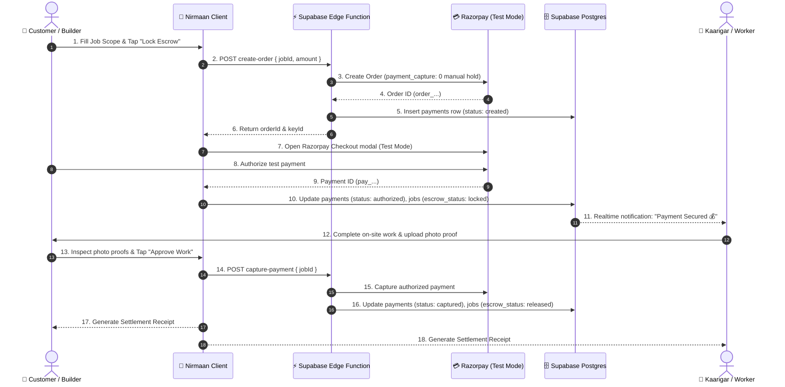

# NIRMAAN Payments & Escrow Architecture

## Overview & Honest Disclosure

NIRMAAN implements a fair and transparent payment lifecycle ensuring:
1. **Customer Confidence:** Funds are locked in escrow when a booking is confirmed and held safely.
2. **Worker Security:** Workers see "Payment Secured" before beginning work on site, eliminating payment evasion.
3. **Approval Gate:** The customer inspects the completed work and releases funds directly to the Kaarigar.

> [!NOTE]
> **Test Mode vs Live Mode:**
> For hackathon evaluation and demonstration, payments operate in **Razorpay Test Mode** or the authenticated **Supabase Test Ledger**. All transitions (Order Creation → Authorization / Lock → Verification → Capture → Settlement Receipt) operate on the identical state machine and code paths without real banking transactions. The UI prominently displays the **"Test Mode"** badge.

---

## Escrow Lifecycle Diagram



---

## What is Real vs What is Test

| Component | Status | Behavior |
|---|---|---|
| **Escrow State Machine** | **100% Real** | Enforced in Supabase PostgreSQL tables & RPCs (`jobs.escrow_status`, `advance_job`). |
| **Order Generation** | **Real** | Deno Edge Function `create-order` creates manual-capture orders in Razorpay. |
| **Checkout UI** | **Real** | Lazy-loaded Razorpay Checkout.js with custom brand theme `#E8621A`. |
| **Database Ledger Fallback** | **Real** | If Razorpay keys are not provided, an authenticated Test Ledger records payments with exact IDs. |
| **Money Movement** | **Test Mode** | Real money is not debited; test card/UPI credentials are used. |

---

## Deployment & Secrets Setup (Part A Step 6)

### 1. Set Function Secrets in Supabase Dashboard
In **Supabase Dashboard → Project Settings → Edge Functions → Secrets**, add:
- `RAZORPAY_KEY_ID`: `rzp_test_...` (from Razorpay Dashboard → Settings → API Keys)
- `RAZORPAY_KEY_SECRET`: `...`
- `RAZORPAY_WEBHOOK_SECRET`: `...` (optional, for webhook verification)

### 2. Deploy Edge Functions via Supabase CLI
```bash
supabase functions deploy create-order
supabase functions deploy razorpay-webhook
supabase functions deploy capture-payment
supabase functions deploy refund-payment
```
